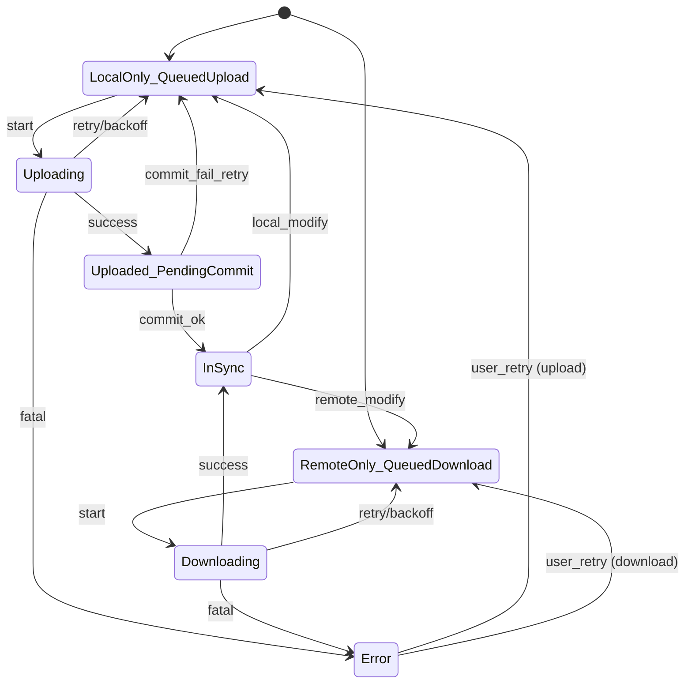
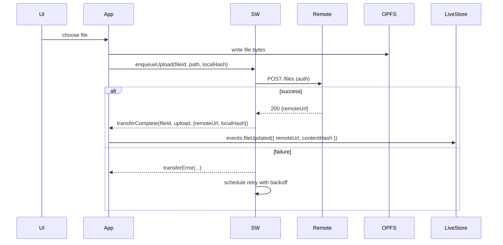
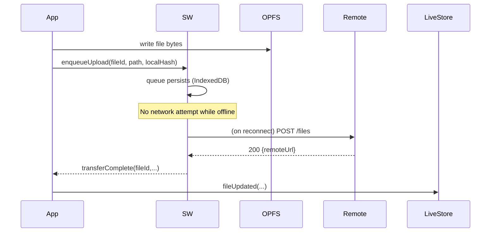
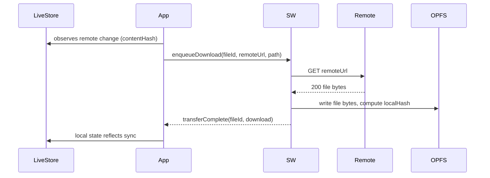
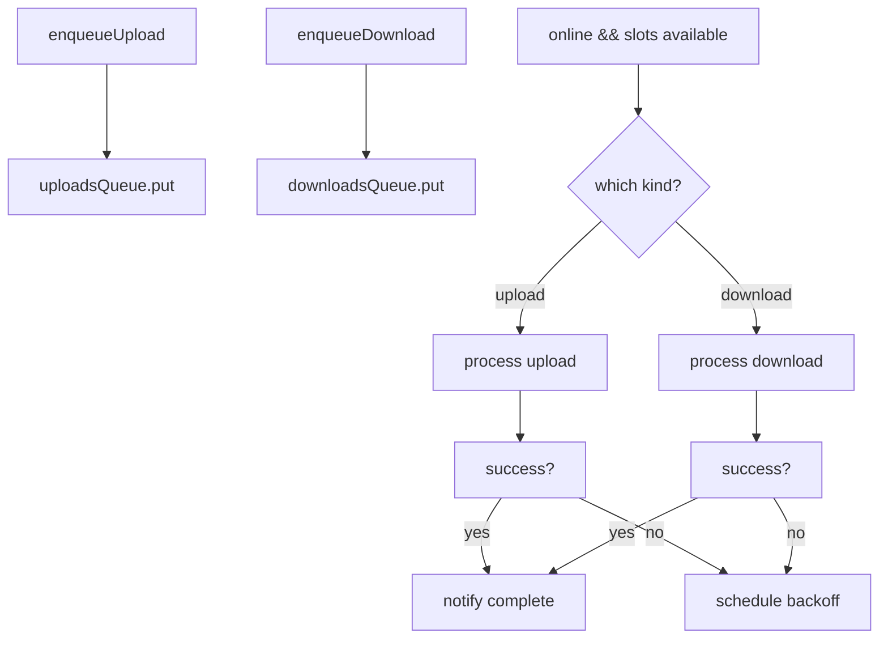

## Workbox-centered architecture for uploads and offline caching

This document proposes a service worker–centered design where Workbox handles both offline caching and upload queueing. It compares against the current implementation that relies on app-driven sync logic in `src/services/file-sync.ts` and `src/services/sync-executor.ts`, and it details flows for online/offline scenarios, state models, message contracts, and a pragmatic migration plan.

References: [Workbox docs](https://developer.chrome.com/docs/workbox)

### Current architecture (baseline)

- App writes/reads files to OPFS and maintains metadata in LiveStore.
- `public/sw.js` serves `/files/*` as OPFS-first with network fallback to `FILES_BASE_URL`.
- The app-level synchronizer performs detection and transfer orchestration:

```23:45:src/services/sync-executor.ts
export function createSyncExecutor(options: SyncExecutorOptions) {
  const maxPerKind: Record<TransferKind, number> = {
    download: options.maxConcurrentPerKind?.download ?? 2,
    upload: options.maxConcurrentPerKind?.upload ?? 2,
  }
  // ... concurrency, backoff, pause/resume, queue management ...
}
```

```200:233:src/services/file-sync.ts
const executor = createSyncExecutor({
  maxConcurrentPerKind: { download: 2, upload: 2 },
  isOnline: () => {
    const { online } = store.query(queryDb(tables.uiState.get()))
    return online
  },
  run: async (kind, fileId) => {
    if (kind === 'download') {
      setLocalFileTransferStatus(fileId, 'download', 'inProgress')
      const newLocalFile = await downloadRemoteFile(fileId)
      mergeLocalFiles(newLocalFile)
    } else {
      setLocalFileTransferStatus(fileId, 'upload', 'inProgress')
      const { localFiles: latest } = store.query(queryDb(tables.localFileState.get()))
      const latestLocal = latest[fileId]
      if (!latestLocal) return
      const newLocalFile = await uploadLocalFile(fileId, latestLocal)
      mergeLocalFiles(newLocalFile)
    }
  }
})
```

Key properties today:
- Concurrency and backoff are explicit and tunable per transfer kind.
- Health checks drive online state and resume logic.
- LiveStore is updated from the app on upload success.
- Service worker only proxies read requests for `/files/*` and does not manage transfers.

### Proposed architecture: SW-first with Workbox

Core idea: move transfer orchestration into the service worker using Workbox primitives and plugins, while the app becomes thinner. The SW is the single gate for file IO and network transfers, giving robust retry and offline UX even when the app isn’t in the foreground.

- Routing: Workbox `registerRoute` keeps `/files/*` as OPFS-first, network fallback; add runtime caching policies for non-file assets.
- Upload queueing: Workbox Background Sync queues `POST`/`PUT` requests and replays on connectivity restoration. For wider control, use `workbox-background-sync`’s `Queue` directly to implement custom concurrency, backoff, and tagging.
- Precaching: `workbox-precaching` for static shell with revisioning.
- Messaging: `workbox-window` to communicate queue/progress to the app, and to accept enqueue requests from the app.
- Optional: `workbox-range-requests` for media; plugins for auth, expiration, and error handling.

### State model (service worker–centric)

We define a per-file finite state machine (FSM) tracked in SW IndexedDB (queue metadata) and reflected into LiveStore via app or SW:



State sources of truth:
- SW IndexedDB: queue items, attempts, backoffUntil, lastError, bytesTransferred.
- OPFS: file bytes and local hash/version for cache-busting (`?v=`) of reads.
- LiveStore: canonical metadata: `remoteUrl`, `contentHash`, `deletedAt`.

### Message contract (app ↔ SW)

Transport: `postMessage` to SW via `workbox-window` and `BroadcastChannel` for multi-tab.

- App → SW
  - `enqueueUpload` { fileId, path, localHash, headers? }
  - `enqueueDownload` { fileId, remoteUrl, path }
  - `cancelTransfer` { fileId, kind }
  - `rehydrateQueues` {}
  - `setAuth` { bearer }

- SW → App
  - `transferProgress` { fileId, kind, bytesSent, bytesTotal }
  - `transferComplete` { fileId, kind, localHash?, remoteUrl? }
  - `transferError` { fileId, kind, code, message, retryAt? }
  - `queueSnapshot` { uploads: [...], downloads: [...] }
  - `waitingForActivation` {}

App responsibilities in this model:
- Update LiveStore on `transferComplete` for uploads (set `remoteUrl`, `contentHash`).
- Trigger `markLocalFileChanged` equivalent by sending `enqueueUpload` after local writes.
- Optionally, let SW perform the LiveStore commit via an authenticated HTTP API if you want updates to occur without a tab open. See “Variants” below.

### Scenarios and flows

#### A. Online: create new local file (upload path)



Notes:
- If Background Sync is supported, failures offline are auto-queued and replayed.
- App remains the source of LiveStore updates unless Variant B is chosen.

#### B. Offline: create new local file (upload later)



Notes:
- If the app isn’t open when connectivity returns, you either:
  1) Have SW call a LiveStore HTTP endpoint to perform the commit (Variant B), or
  2) Defer the LiveStore update until app opens and SW replays a `queueSnapshot`/`transferComplete` on startup (Variant A).

#### C. Online: remote change detected (download)



#### D. Offline: remote exists, local missing (cold-start download later)

- App sees file with `remoteUrl` but no local copy; it sends `enqueueDownload`.
- SW queues the GET and on reconnect downloads to OPFS, then notifies the app.

#### E. Error handling and backoff

- SW stores attempts and nextRetryAt per file.
- Exponential backoff capped at a max (configurable).
- Distinguish fatal errors (auth 401/403, permanent 4xx) vs retryable (5xx, network).
- Token refresh: app updates SW via `setAuth` message or SW refreshes on its own with a refresh endpoint.

### Variants for LiveStore commit ownership

- Variant A (App-Commit): SW focuses on bytes transfer; app processes `transferComplete` and updates LiveStore. Simple and keeps business logic in the app. If app isn’t open at reconnect, LiveStore updates are deferred until next open.

- Variant B (SW-Commit): SW calls a LiveStore HTTP endpoint to finalize metadata, enabling fully headless sync. Requires packaging auth libraries/logic in the SW. Useful if you want uploads to complete and metadata to finalize without user action.

Trade-off: Variant B increases SW complexity and security exposure; Variant A is simpler but requires app presence to finalize metadata.

### Concurrency and backoff in Workbox

Workbox Background Sync queues and replays requests; it doesn’t expose per-kind concurrency knobs out of the box. Options:

- Use Workbox `Queue` directly and process with a custom worker routine that respects per-kind limits similar to `createSyncExecutor`.
- Maintain two named queues: `uploads` and `downloads` and pop from them under desired parallelism.
- Store attempts/backoff in IndexedDB alongside the queue; sleep until `retryAt` before dispatching.

Pseudo-structure (SW):



### Advantages vs current approach

- Fewer moving parts in the app; SW owns retries and survives tab reloads.
- Unified offline semantics with Background Sync where supported.
- Standardized caching strategies and quota/expiration controls for non-file assets.
- Clear message contract makes UI simple: render from LiveStore and react to SW events.
- Optional headless finalization (Variant B) if you need uploads to complete when app is closed.

### Drawbacks and risks

- Background Sync isn’t supported in all browsers (notably iOS Safari). A hybrid fallback is needed: keep a minimal app-level executor for unsupported environments.
- Concurrency controls require custom queue processing; Workbox defaults won’t match `createSyncExecutor`’s knobs without extra logic.
- SW complexity increases if SW also commits to LiveStore (auth, error handling, migrations).
- Potential duplication if you also cache file bytes in Cache Storage; prefer OPFS-only for file bytes to avoid double storage.
- Token lifecycle management must be handled in SW as well as app (or centralized via messages).

### Hybrid strategy (recommended)

- Use Workbox universally for routing, offline shell, and non-file runtime caching.
- Implement SW-managed queues for uploads/downloads with app-driven LiveStore commits (Variant A).
- Maintain a tiny app fallback executor that activates only on browsers without Background Sync, using the same message contract for consistency.
- Keep OPFS as the source of file bytes; avoid Cache Storage for large files.

### Migration plan

1) Introduce Workbox SW without changing file transfer ownership
   - Keep OPFS-first `/files/*` route.
   - Add precaching and SW lifecycle controls (`workbox-window`).

2) Define and implement the message contract
   - App sends `enqueueUpload/Download` after local writes or remote changes.
   - SW stores queues and acknowledges with `queueSnapshot`.

3) Move upload/download execution into SW
   - Implement custom `Queue` processors with per-kind concurrency and backoff.
   - Emit `transferProgress/Complete/Error` events.

4) Optional: Headless LiveStore commit
   - Add authenticated endpoint for SW to finalize metadata, or keep app-commit (simpler).

5) Fallback path
   - Detect unsupported Background Sync and enable a minimal app executor that uses the same flows.

### API surfaces (summary)

- App → SW
  - `enqueueUpload(fileId, path, localHash, headers?)`
  - `enqueueDownload(fileId, remoteUrl, path)`
  - `cancelTransfer(fileId, kind)`
  - `rehydrateQueues()`
  - `setAuth(bearer)`

- SW → App
  - `transferProgress({ fileId, kind, bytesSent, bytesTotal })`
  - `transferComplete({ fileId, kind, remoteUrl?, localHash? })`
  - `transferError({ fileId, kind, code, message, retryAt? })`
  - `queueSnapshot({ uploads, downloads })`

### Edge cases to cover

- Delete while queued: SW cancels queued uploads and removes OPFS bytes; notifies app to clear metadata.
- Rename/move: treat as new file id or support server-side rename endpoint.
- Conflict: remote changed while local pending; policy needed (last-write-wins or server reconcile).
- Token expiry: SW retries after refresh; if app owns token, SW requests `setAuth`.
- Large files/resumability: implement chunked uploads with SW-managed parts; Background Sync queues each chunk; app or SW performs finalization.
- Range reads for media: use `workbox-range-requests` for partial GET support if caching beyond OPFS is added.

### Conclusion

A Workbox-centered SW can unify offline caching and transfer retries, reducing app complexity while improving resilience. A hybrid deployment preserves current behavior where needed and introduces SW-queue ownership incrementally. Prefer Variant A (app commits LiveStore) initially, and only move to SW-commit if headless completion is a hard requirement.

Further reading: [Workbox overview](https://developer.chrome.com/docs/workbox)


